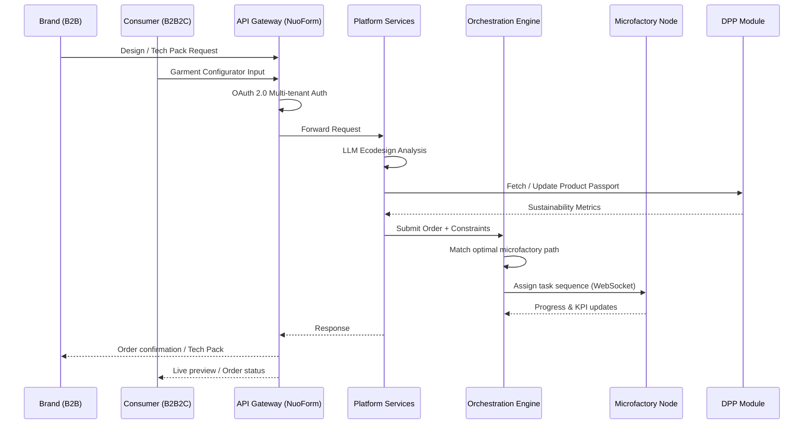
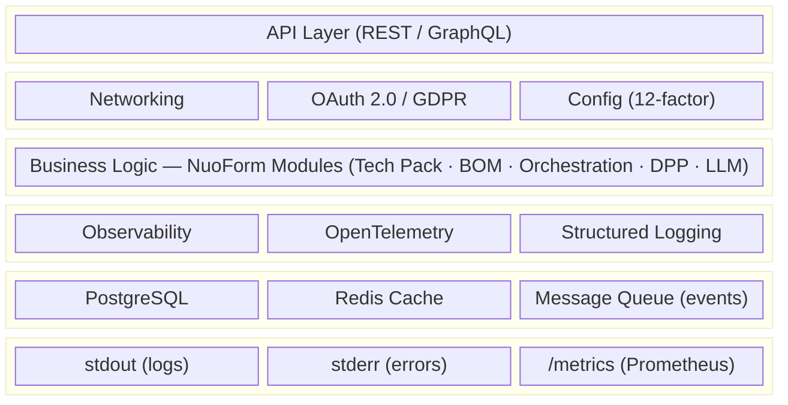
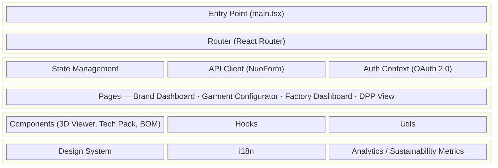

# ALADIN — Digital Platform (NuoForm)

> Advanced LocAl and Digital Innovation Network for Circular Garments — Horizon Europe IA · Proposal 101294463 · 48 months
>
> Katty Fashion SRL leads **WP2 & WP3**: design, development and expansion of the ALADIN Digital Platform, built on the NuoForm foundation, enabling B2B and B2B2C co-design, orchestration, Digital Product Passports (DPP), and garment circularity across a pan-European microfactory network.

## Quick Links

- [KF Dashboard](https://katty-fashion.github.io/kf-cpto/) — Unified project view
- [Project Page](https://katty-fashion.github.io/kf-cpto/projects/aladin-01.html) — Auto-generated from kanban
- [Unified Kanban](https://katty-fashion.github.io/kf-cpto/unified-kanban.html) — All tasks across KF Team

---

## Project Overview

ALADIN addresses the overproduction and waste caused by long, globalised textile supply chains by enabling **local-for-local, on-demand manufacturing** through two core innovations:

1. **Digital Platform (NuoForm-based)** — design, co-creation, ordering, orchestration, and DPP services for brands, microfactories, and end consumers.
2. **Network-Microfactory** — regional, circular, on-demand manufacturing nodes coordinated through the platform.

Three garment use cases validate the approach: a **semi-automated T-shirt**, a **smart kidswear parka**, and a **circular blazer-dress**. Target TRL 6–7 by project end (2029).

Katty Fashion is the **WP2 & WP3 leader** — responsible for all platform architecture, frontend, backend, and deployment.

---

## Architecture

### High-Level Design (HLD) — Sequence Flow



### Backend Service Anatomy

Every backend service/container follows this standard architecture:



**Layer Responsibilities:**

| Layer | Components | Purpose |
| :--- | :--- | :--- |
| **API Layer** | REST endpoints, GraphQL resolvers | External interface for brands, consumers, microfactories |
| **Infrastructure** | Kubernetes, TLS, CORS, OAuth 2.0 multi-tenant | Cross-cutting: security, GDPR compliance |
| **Business Logic** | Tech Pack, BOM, LLM ecodesign, Orchestration engine, DPP, Garment Configurator | Core NuoForm platform features |
| **Observability** | OpenTelemetry, Prometheus, structured logs | Monitoring & debugging |
| **I/O** | PostgreSQL, Redis, Message Queue | Data persistence & real-time messaging |
| **Output** | stdout/stderr, `/metrics` | Container output streams |

**Minimum Requirements for Production:**

```yaml
observability:
  - health_check: /health
  - readiness: /ready
  - metrics: /metrics (Prometheus format)
  - tracing: OpenTelemetry spans

logging:
  - format: JSON structured
  - output: stdout (info), stderr (errors)
  - correlation_id: request tracing

config:
  - env_vars: 12-factor app
  - secrets: mounted from vault / k8s secrets
  - feature_flags: runtime toggles

security:
  - auth: OAuth 2.0 multi-tenant, role-based access
  - gdpr: privacy-by-design, data minimisation
  - infra: Kubernetes-based cloud, CI/CD pipeline
```

### Frontend (React Web) Anatomy



**Frontend Layer Responsibilities:**

| Layer | Components | Purpose |
| :--- | :--- | :--- |
| **Entry** | main.tsx, App.tsx | Bootstrap application |
| **Routing** | React Router, layouts | Navigation & URL mapping |
| **State** | React Query, Context | Data management & API sync |
| **Pages** | Brand Portal, Garment Configurator, Factory Dashboard, DPP | Screen-level components |
| **Components** | 3D visualisation, Tech Pack editor, BOM manager | Reusable UI building blocks |
| **Infrastructure** | Theme, i18n, sustainability scoring | Cross-cutting concerns |

---

## Work Packages — Katty Fashion Scope

| WP | Title | KF Role | Key Tasks |
| :--- | :--- | :--- | :--- |
| **WP2** | Development of ALADIN Digital Platform services | **Leader** | T2.1 Architecture & user journeys · T2.2 Core platform & LLM · T2.3 B2C configurator · T2.4 DPP module · T2.5 Orchestration MVP |
| **WP3** | Expansion of ALADIN Digital Platform services | **Leader** | T3.1 B2B full integration · T3.2 Configurator validation · T3.3 Circularity module · T3.4 Factory dashboard & interoperability toolkit |
| WP1 | Ecodesign, R-Strategies & Business Models | Participant | Target group profiling, business model testing |
| WP4 | Materials & Technologies — Development | Participant | Circular blazer-dress design, material sourcing |
| WP5 | Materials & Technologies — Improvement | Participant | Use case refinement post-DEMO 1 |
| WP6 | Demonstration | Participant | DEMO 1 & 2, LCA, blueprint |
| WP8–10 | SME Innovation Support (FSTP) | Participant | Call definition, SME coaching |
| WP11–12 | Communication, Dissemination & Exploitation | Participant | Exploitation pathways, IP management |

---

## Kanban Management

This repository uses a `kanban.md` file for task tracking that integrates with the [KF-CPTO Dashboard](https://github.com/katty-fashion/kf-cpto).

### Updating Tasks

Edit `kanban.md` in the repository root:

```markdown
---
project: aladin-01
sprint: S2
sprint_start: 2026-03-16
sprint_end: 2026-03-27
---

# Project Kanban

| Task | Assignee | Effort | Start | End | Status |
| :--- | :--- | :--- | :--- | :--- | :--- |
| B2B Tech Pack editor MVP | razvan.boita@katty-fashion.ro | 3d | 2026-03-16 | 2026-03-18 | In Progress |
```

### Task Status Values

| Status | Description |
| :--- | :--- |
| `Todo` | Not started |
| `In Progress` | Currently being worked on |
| `Review` | Awaiting code review or approval |
| `Done` | Completed |

### Effort Format

Use `Nd` format where N is the number of days (e.g. `1d`, `0.5d`, `3d`).

### Sprint Updates

Update the frontmatter at the start of each sprint:

```yaml
---
project: aladin-01
sprint: S2              # Increment sprint number
sprint_start: 2026-03-16
sprint_end: 2026-03-27
---
```

---

## Development

### Prerequisites

```bash
# Required tools
- Node.js 20+ (frontend)
- Python 3.11+ (backend services / LLM pipeline)
- Docker & Docker Compose
- kubectl (Kubernetes deployments)
- Helm (chart management)
```

### Setup

```bash
# Clone the repository
git clone https://github.com/katty-fashion/aladin-01.git
cd aladin-01

# Install frontend dependencies
cd frontend && npm install

# Install backend dependencies
cd ../backend && pip install -r requirements.txt --break-system-packages
```

### Running Locally

```bash
# Start all services via Docker Compose
docker compose up --build

# Frontend only (dev server)
cd frontend && npm run dev

# Backend only
cd backend && uvicorn main:app --reload
```

### Testing

```bash
# Frontend unit tests
cd frontend && npm test

# Backend tests
cd backend && pytest

# E2E tests
npm run test:e2e
```

---

## Project Structure

```
aladin-01/
├── kanban.md                        # Task tracking (synced to KF-CPTO)
├── README.md                        # This file
├── .github/
│   └── workflows/
│       └── notify-kf-cpto.yml       # Auto-sync to KF dashboard
├── frontend/                        # React web application
│   ├── src/
│   │   ├── pages/                   # Brand Portal, Configurator, DPP, Factory Dashboard
│   │   ├── components/              # 3D Viewer, Tech Pack Editor, BOM Manager
│   │   ├── hooks/                   # Custom React hooks
│   │   ├── api/                     # NuoForm API client
│   │   └── auth/                    # OAuth 2.0 multi-tenant context
│   └── public/
├── backend/                         # Python / Node backend services
│   ├── api/                         # REST endpoints (Tech Pack, BOM, Orders, DPP)
│   ├── orchestration/               # Microfactory matching & task sequencing engine
│   ├── llm/                         # LLM pipeline — ecodesign sustainability suggestions
│   ├── dpp/                         # Digital Product Passport module
│   ├── models/                      # Data models
│   ├── config/                      # Configuration (12-factor)
│   └── utils/                       # Utilities
├── infra/
│   ├── k8s/                         # Kubernetes manifests
│   ├── helm/                        # Helm charts
│   └── docker-compose.yml           # Local dev environment
├── tests/                           # Test suites
└── docs/                            # Architecture & API documentation
```

---

## KF-CPTO Integration

### Automatic Sync

When you push changes to `kanban.md`, the KF-CPTO dashboard automatically updates via GitHub Actions.

### Manual Trigger

```bash
# Via GitHub CLI
gh workflow run notify-kf-cpto.yml
```

---

## Contributing

1. Create a feature branch: `git checkout -b feature/my-feature`
2. Update `kanban.md` with your task
3. Make your changes
4. Update task status in `kanban.md`
5. Commit and push
6. Create a Pull Request

---

## Team

| Role | Contact |
| :--- | :--- |
| Product Owner | [ps.tech@katty-fashion.ro](mailto:ps.tech@katty-fashion.ro) |
| Tech Lead | [el.tech@katty-fashion.ro](mailto:el.tech@katty-fashion.ro) |
| Back-End | [razvan.boita@katty-fashion.ro](mailto:razvan.boita@katty-fashion.ro) |
| Front-End | [alexandru.bejenari@katty-fashion.ro](mailto:alexandru.bejenari@katty-fashion.ro) |
| Organisation | [Katty Fashion SRL](https://www.katty-fashion.ro) · Iași, Romania |

---

## Consortium (ALADIN)

| # | Organisation | Country | Role |
| :--- | :--- | :--- | :--- |
| 1 | DITF — Deutsche Institute für Textil- und Faserforschung | DE | Coordinator |
| 2 | **Katty Fashion SRL** | **RO** | **Partner — WP2/WP3 Leader** |
| 3 | CENTEXBEL | BE | Partner |
| 4 | Mitwill Textiles Europe | FR | Partner |
| 5 | VORN eG — The Berlin Fashion Hub | DE | Partner |
| 6 | ASOCIATIA REGINNOVA NE | RO | Partner |
| 7 | CEDECS-TCBL | FR | Partner |
| 8 | NIL Textile s.r.o. | CZ | Partner |
| 9 | Politecnico di Milano | IT | Partner |
| 10 | Steinbeis Innovation gGmbH | DE | Partner |

---

*Part of [KF Team](https://github.com/katty-fashion) · Managed via [KF-CPTO](https://github.com/katty-fashion/kf-cpto) · Funded by Horizon Europe — HORIZON-CL4-INDUSTRY-2025-01-MATERIALS-31*
